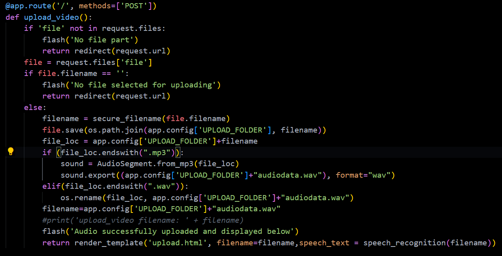

**What is flask?**

Flask is a web development framework developed in Python. Flask is what’s known as a WSGI framework. Mercifully pronounced “whiskey,” this stands for ​​Web Server Gateway Interface. Essentially, this is a way for web servers to pass requests to web applications or frameworks. Flask relies on the WSGI external library to function, as well as the Jinja2 template engine.

**Why use flask?**

**Flask is mainly used to develop small-scale applications. Flask has too many advantages, such as :**

- Scalable

Size is everything, and Flask’s status as a microframework means that you can use it to grow a tech project such as a web app incredibly quickly. If you want to make an app that starts small, but has the potential to grow quickly and in directions you haven’t completely worked out yet, then it’s an ideal choice. Its simplicity of use and few dependencies enable it to run smoothly even as it scales up and up.

- Flexible

This is the core feature of Flask, and one of its biggest advantages. To paraphrase one of the principles of the [Zen of Python](https://www.python.org/dev/peps/pep-0020/#the-zen-of-python), simplicity is better than complexity, because it can be easily rearranged and moved around.

Not only is this helpful in terms of allowing your project to move in another direction easily, but it also makes sure that the structure won’t collapse when a part is altered. The minimal nature of Flask and its aptitude for developing smaller web apps means that it’s even more flexible than Django itself.

- Easy to negotiate

Like Django, being able to find your way around easily is key for allowing web developers to concentrate on just coding quickly, without getting bogged down. At its core, the microframework is easy to understand for web developers, not just saving them time and effort but also giving them more control over their code and what is possible.

- Lightweight

Flask is extremely lightweight with performs the instruction set much better than any other framework available. Flask also supports modular programming, which is where its functionality can be split into several interchangeable modules. Each module acts as an independent building block, which can execute one part of the functionality. Together this means that the whole constituent parts of the structure are flexible, moveable, and testable on their own.

- Clean and example-based documentation

This is why flask is used to build here, transcriptor as a service is a lot more complex and takes much time to implement but as a website that navigates the crud operations between users and the server, we need a **lightweight framework** to maximize the performance of the application.

**How are we using flask in this application?**

Firstly, we’ve set a maximum content(file) feeding size to avoid the runtime, and server timeout and also the avoid a bad user experience. Of course, a user cannot keep on waiting forever until the machine learning models implemented in the backend are executed successfully.

**Inside fetching and storing files:**

When the app starts running. It is directed to the “http://<localhost>/” by default. At this stage, a file called ***upload.html*** is rendered to the webpage. 

Before upload.html:

` `A base file base.html is rendered first to the webpage which is common to all the URLs that the app uses to function as desired. This base.html contains the necessary boilerplate of all the HTML files used. Later this base.html can be extended to other HTML files to avoid retyping all the code once again.

` `Why are we using this base.html?

- To increase the reusability that flask features.
- To increase the readability of the code.
- **File should be within the limit 16MB.**

Coming to uploads.html,

Uploads.html contains the components to choose the audio file. Initially, the file only contains 

- An empty textarea
- Choose audio file
- Submission/Upload button

Submission conditions:

1. The file must not be empty.
1. The file must be an audio file(mp3 or wav only).

After the file is submitted:

`           `On successful submission, flask sends an HTTP POST request. This is where the magic begins.

An endpoint specified with the POST method is initiated, thus once again the webpage loads the same “**http://<localhost>/**” URL. But this time it renders different components. Let’s understand what the function **upload\_video()** inside the post request’s endpoint does.

Firstly, the function checks if the file inputted by the user is available to the backend. If not flashes a message “No file part” to the screen. If the inputted file doesn’t have a name(i.e no file is selected by the user) a flask flash message “No file selected for uploading” is displayed at the top. However, these two statements are of no use since HTML handles the process of fetching the suitable file before submission.

If the file is successfully received by the backend, it is stored inside the “uploads” folder of the program and flashes “Audio successfully uploaded and displayed below” message. 

Now the file is renamed to “audiodata.wav” to dynamically operate on the app. Note that if the audio file is in **.mp3** format the program converts the file to **.wav** with the support of the ffmpeg module. 

In the last line of the function, **speech\_text = speech\_recognition(filename)** means the value returned from the external function **speech\_recognition()** is stored in the variable **speech\_text.**

**Exploring speechRec.py:**
**
`           `The code here may look simple, but this is the most important file in the entire application. SpeechRec.py serves the purpose of this application. It transcribes the given speech input to text output.

For this transcription, “**speech\_recognition**” module is used which employs the Google API. After the execution, the output contents are stored as a String in the return variable **text.**

(Note that this Google API requires internet and may take high execution time during the process.)

**Process at upload.html:**

`           `-> Flash messages by flask are displayed sequentially at the top of the webpage.

`           `-> Inputted audio by the user plays to ease verification of transcription content.

`           `-> **text** is accessed by the HTML file and fills(displays) the transcription content inside the empty textarea mentioned above.
